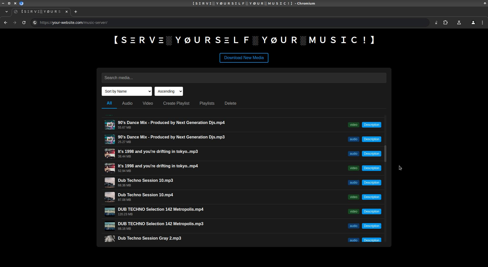
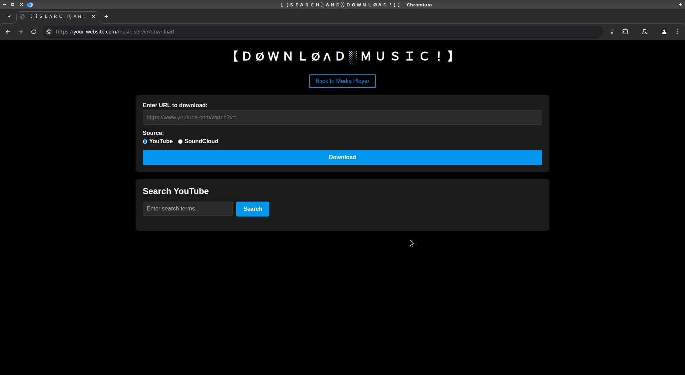
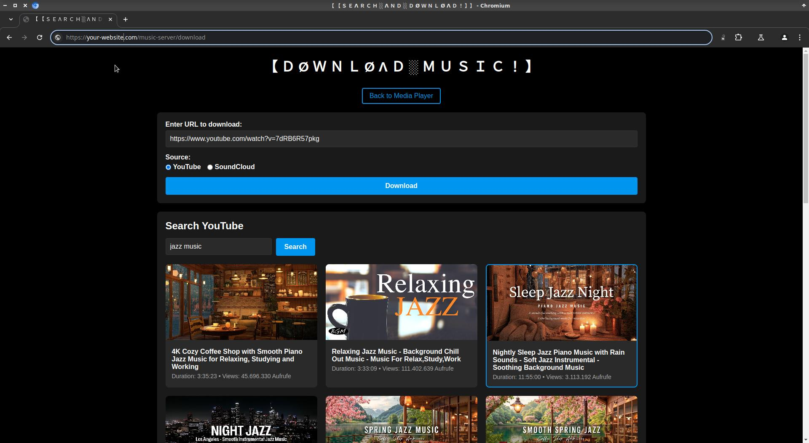

---

# Media Player, Search & Downloader

A web-based media player and downloader application that allows you to download, store, and play media content from YouTube and SoundCloud. The application is designed to be deployed on a remote server, providing a centralized media library accessible through a web interface.

Index page with the media player, media types, playlist creation, and item deletion: 
<div align="center">  </div>

<br> 

Download page with search 
<div align="center">  </div>

<br> 

Search and select media
<div align="center">  </div>

# Disclaimer 

📣 The frontend-part of this application (css, js, html) was purely and entirely coded with Cursor AI Code Editor, without technical supervision. Although, the main functionalities have been tested qualitatively, it is by no means perfect. The code provided here can be also used as a statement about the capabilities and limitation of AI generated code (in the frame of [Cursor - The AI Code Editor](https://www.cursor.com/) - written on 29.03.2025).

📣 This code does not promote downloading video material, it just provides a player for streaming any media you have.

Downloading videos from YouTube, including music videos, is generally against YouTube's Terms of Service (ToS) 
unless you have explicit permission from the copyright holder or 
YouTube provides an official download option. YouTube explicitly states that users may not download content unless:

- There's a download button provided by YouTube.
- The content is available through YouTube Premium (which allows offline viewing).
- You have express permission from the copyright owner.

Copyright Law and Legal Considerations

- Most music videos are copyrighted, downloading them without permission could violate copyright laws.
- YouTube Premium: Allows official downloads for offline viewing.
- Creative Commons & Public Domain Content: Some videos on YouTube are legally downloadable if they are licensed under Creative Commons.

By using this code you may violate YouTube's ToS causing account suspension, banning, or possible copyright infringement (legal consequences, fines).


## Features

- **Media Download**
  - Download videos and audio from YouTube
  - Download tracks from SoundCloud
  - Automatic audio extraction from videos
  - Thumbnail and description preservation
  - Progress tracking during downloads

- **Media Player**
  - Web-based media player interface
  - Support for both audio and video playback
  - Streaming capabilities with range request support
  - Organized media library with thumbnails
  - File management (delete, sort, search)

- **YouTube Integration**
  - Built-in YouTube search functionality using `yt-dlp` (with [daily latest version](https://pypi.org/project/yt-dlp/#history))
  - Direct download from search results
  - High-quality thumbnail support

## Technical Stack

- **Backend**: Python/Flask
- **Frontend**: HTML/JavaScript
- **Real-time Updates**: Flask-SocketIO
- **Media Processing**: moviepy, ffmpeg
- **Download Tools**: yt-dlp, youtube-dl
- **Containerization**: Docker
- **CI/CD**: GitHub Actions


## Installation

1. Clone the repository:
```bash
git clone <repository-url>
cd youtube-scraping
```

2. Install Python dependencies:
```bash
pip install -r requirements.txt
```

3. Use `make` to run the app locally, or to run containerization and deployment. 


## Project Structure

```
.
├── .github/workflow       # GitHub Actions workflows
├── templates/            # HTML pages, css, js 
├── downloads/            # Media storage directory - all media files (audio, video, images) will be stored here
├── Dockerfile            # Container configuration
├── Makefile             # run configuration for managing deployment scenarios
└── webplayer.py          # Main application in python flask 

```

## API Endpoints

The following endpoint define the main functionality of the flask application.

- `/download`: Media download interface
- `/media`: List available media files
- `/stream/<filename>`: Stream media files
- `/search`: YouTube search functionality

## Security Considerations

- The application uses secure file handling and sanitization
- Media files are stored in a dedicated directory
- File access is controlled through the web interface
- No direct file system access is exposed


---

## Deployment and updating the yt-dlp

In you deployment server, you need to define an environmental variable $MEDIA_STREAMER_LOCAL_PATH, pointing to the path of the project. 
Add it to the .bashrc for convenience. 

The cronjob command is then:

`0 4 * * * /bin/bash -c "source /root/.bashrc && cd $MEDIA_STREAMER_LOCAL_PATH && make restart_docker" >> /tmp/cron.log 2>&1`

## Setting up Github Workflow for a remote server deployment 

### Setting up connection between the runner and the remote server

__On the remote machine:__ 

Generate a new key pair: 

`ssh-keygen -t ed25519 -f github_actions_key -N ""`

Add the public key (contents of github_actions_key.pub) to your server's ~/.ssh/authorized_keys file


__On Github Action Secrets define:__ 

Add the private key (contents of github_actions_key) to your GitHub secrets as SSH_PRIVATE_KEY


```bash
SSH_PRIVATE_KEY - the above mentioned `github_actions_key`
SERVER_HOST - hostname/IP
SERVER_USER - username 
MEDIA_STREAMER_LOCAL_PATH 
```

The `MEDIA_STREAMER_LOCAL_PATH` would be required, if there are multiple projects deployed on the server. It could be for example: "/home/Projects/youtube-rocket"

### How it works: 

The main part of the deployment is to trigger the `restart_docker` target in the Makefile. This is out of convenience, as all the docker commands are defined in the Makefile for ease of execution.  

```yaml
    - name: Execute remote command
      run: |
        ssh ${{ secrets.SERVER_USER }}@${{ secrets.SERVER_HOST }} 'cd ${{ secrets.MEDIA_STREAMER_LOCAL_PATH }} && make restart_docker'
```

The section: 

```yaml
    - name: Set up SSH key with debugging
      run: |
        mkdir -p ~/.ssh
        echo "${{ secrets.SSH_PRIVATE_KEY }}" > ~/.ssh/id_rsa
        chmod 600 ~/.ssh/id_rsa
        ls -la ~/.ssh/id_rsa
        ssh-keyscan -H ${{ secrets.SERVER_HOST }} >> ~/.ssh/known_hosts

```

is setting up SSH key authentication with added debugging commands to help troubleshoot connection issues. Here's what each line does:

`mkdir -p ~/.ssh` creates the .ssh directory in the runner's home folder if it doesn't already exist. The `-p` flag prevents errors if the directory already exists.

`echo "${{ secrets.SSH_PRIVATE_KEY }}" > ~/.ssh/id_rsa` takes the private SSH key stored in GitHub Secrets and writes it to the id_rsa file in the .ssh directory. This is the standard location for the default SSH private key.

`chmod 600 ~/.ssh/id_rsa` sets the correct permissions on the private key file. SSH requires private keys to be readable only by the owner (not by group or others) for security reasons.

`ls -la ~/.ssh/id_rsa` a debugging command that displays the permissions, size, and other details of the SSH key file. It helps verify that the file exists and has the correct permissions (should show "-rw-------" or similar).

`ssh-keyscan -H ${{ secrets.SERVER_HOST }} >> ~/.ssh/known_hosts`  __automatically adds the server's SSH host key to the known_hosts file to prevent "host authenticity" prompts during the connection.__

This entire section is designed to both set up the SSH connection and provide diagnostic information if something goes wrong, which is helpful for debugging SSH connection issues like the one you encountered.

-- Notes 

This implementation still requires to have an env variable `MEDIA_STREAMER_LOCAL_PATH` added to the `.bashrc`.

---

## Planned functionality next steps and todo's

- [✅] download youtube by link
- [✅] convert video to audio at download time
  - [ ] extend with option to remove video after download keeping only mp3
- [✅] file deletion tab
- [✅] description added (obtained when track in downloaded)
- [ ] recommendation
- [✅] search
- [ ] "what is this track?" (Song recognition - Audio fingerprinting)
- [ ] back-end tasks:
  - [] indexing 
  - [] analytics 

Front-end 
- [ ] playlist 
  - [ ] play next track in playlist automatically 
  - [ ] add track to existing playlist


